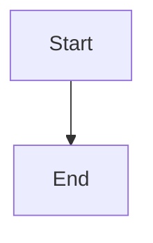

# Obsidian Notes Integration Guide

This guide explains how to publish your Obsidian notes to this website.

## Supported Features

✅ **Mermaid Diagrams** - Flowcharts, sequence diagrams, class diagrams, etc.
✅ **Math Equations** - LaTeX math with KaTeX ($inline$ and $$block$$)
✅ **Tables** - GitHub-flavored markdown tables
✅ **Task Lists** - Interactive checkboxes
✅ **Code Blocks** - Syntax highlighting for all languages
✅ **Callouts** - Via blockquotes
✅ **Images** - Local and external images
✅ **Links** - Internal and external links
✅ **Frontmatter** - YAML metadata
✅ **Wiki-links** - Automatic conversion! `[[Note]]` works directly!

⚠️ **Requires Conversion:**
- Dataview queries (manual conversion needed)
- Plugin-specific syntax
- Embedded notes (use regular images instead)

## How to Add Your Notes

### Step 1: Prepare Your Note

In Obsidian, your note might look like this:

```markdown
# My Note

This is a note with a [[Wiki Link]].


```

### Step 2: Add Frontmatter

Add this at the very top of your markdown file:

```yaml
---
layout: ../../layouts/BaseLayout.astro
title: My Note Title
description: A brief description
---
```

### Step 3: Wiki-Links (Now Automatic!)

**Great news!** Wiki-links now work automatically! You can use them as-is:
- `[[Other Note]]` - works directly!
- `[[Other Note|Display Text]]` - works with custom text!

The system automatically converts them to proper links pointing to `/notes/other-note`.

### Step 4: Convert Mermaid Diagrams

For `.md` files, Mermaid works automatically in code blocks.

For `.mdx` files, use the component:

```markdown
import Mermaid from '../../components/Mermaid.astro';

<Mermaid chart={`
graph TD
    A[Start] --> B[End]
`} />
```

### Step 5: Save to Website

1. Change file extension:
   - `.md` for simple notes with Mermaid in code blocks
   - `.mdx` for notes with Mermaid component or custom components

2. Save to: `src/pages/notes/your-note-name.mdx`

3. Add to the notes index: `src/pages/notes.astro`

## Math Equations Example

Obsidian notation works the same:

```markdown
Inline: $E = mc^2$

Block:
$$
\int_0^\infty e^{-x^2} dx = \frac{\sqrt{\pi}}{2}
$$
```

## Mermaid Diagram Types

### Flowchart
```
graph TD
    A[Start] --> B{Decision}
    B -->|Yes| C[Action]
    B -->|No| D[Other Action]
```

### Sequence Diagram
```
sequenceDiagram
    Alice->>Bob: Hello Bob
    Bob->>Alice: Hi Alice
```

### Class Diagram
```
classDiagram
    Animal <|-- Duck
    Animal <|-- Fish
    Animal : +int age
    Animal : +isMammal()
```

### Gantt Chart
```
gantt
    title Project Timeline
    section Phase 1
    Task 1 :a1, 2024-01-01, 30d
    Task 2 :after a1, 20d
```

### Pie Chart
```
pie title Pets
    "Dogs" : 386
    "Cats" : 85
    "Rats" : 15
```

## File Organization

Recommended structure:

```
src/pages/notes/
├── index.astro              (notes listing page)
├── obsidian-demo.mdx        (example note)
├── programming/
│   ├── javascript.mdx
│   └── python.mdx
├── mathematics/
│   ├── calculus.mdx
│   └── algebra.mdx
└── projects/
    ├── project-1.mdx
    └── project-2.mdx
```

## Automation Ideas

### Script to Convert Wiki-Links

Create a Node.js script to automate conversion:

```javascript
const fs = require('fs');

function convertWikiLinks(content) {
  return content.replace(/\[\[([^\]|]+)(?:\|([^\]]+))?\]\]/g, (match, link, display) => {
    const slug = link.toLowerCase().replace(/\s+/g, '-');
    const text = display || link;
    return `[${text}](/notes/${slug})`;
  });
}

// Use on your files
const content = fs.readFileSync('note.md', 'utf8');
const converted = convertWikiLinks(content);
fs.writeFileSync('note-converted.md', converted);
```

### Obsidian Templater Template

Create a template in Obsidian for web-ready notes:

```markdown
---
layout: ../../layouts/BaseLayout.astro
title: <% tp.file.title %>
description: 
date: <% tp.date.now("YYYY-MM-DD") %>
---

# <% tp.file.title %>

Your content here...
```

## Best Practices

1. **Use meaningful filenames**: `advanced-javascript.mdx` not `note-1.mdx`
2. **Include descriptions**: Helps with SEO and navigation
3. **Test locally**: Run `npm run dev` before deploying
4. **Keep images organized**: Store in `/public/images/notes/`
5. **Update the index**: Add new notes to `notes.astro`

## Troubleshooting

**Mermaid not rendering?**
- Check syntax at [Mermaid Live Editor](https://mermaid.live)
- Ensure you're using the `<Mermaid>` component for `.mdx` files
- For `.md` files, use code blocks with `mermaid` language

**Math not displaying?**
- KaTeX CSS must be loaded (already in BaseLayout)
- Use single `$` for inline, double `$$` for block
- Escape special characters if needed

**Build errors?**
- Check that all imports are correct
- Verify frontmatter YAML is valid
- Look for unclosed tags or brackets

## Example Workflow

1. Write notes in Obsidian as usual
2. When ready to publish:
   - Export note to `src/pages/notes/`
   - Add frontmatter
   - Convert wiki-links
   - Convert Mermaid (if using MDX)
   - Test locally
   - Commit and push
3. GitHub Actions deploys automatically

---

Happy note publishing! 📝✨

